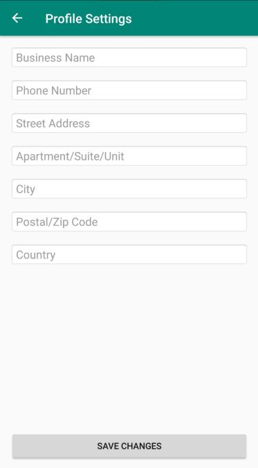
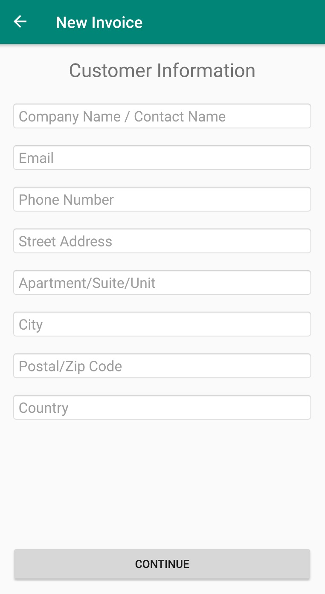
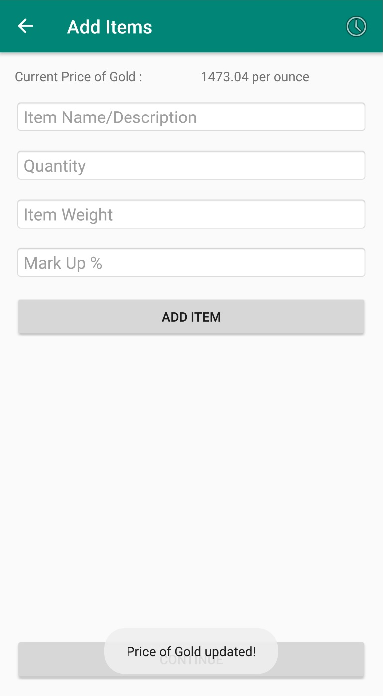
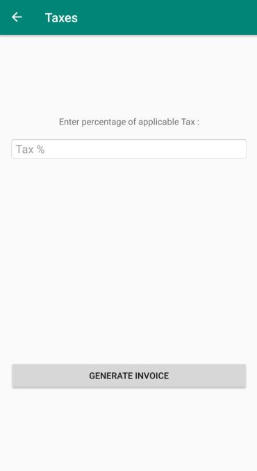

# JewelersInvoice
An android app that helps jewelers make invoices based on the current price of jewelry using an API to get the current price.

## Jewelry Invoices
Our app is designed to have six fragments. 
1. My Invoices
   * Shows a list of previously generated Invoices which are stored and queried from a Room Database.
   * 
   * Home page of the app
   * Can edit User's company information
   * 
   * Can start new Invoices
2. New Invoices
   * Has EditTexts to get User input about the User's customer
   * Can go to Invoice Items
   * 
3. Invoice Items
   * Has EditTexts to get User input about the customer's purchase items and pricing.
   * 
   * Can go to Applicable Tax
4. Applicable Tax
   * Has and EditText for Tax input
   * Can go to Invoice Visualizer
   * 
5. Invoice Visualizer
   * This is where a pdf would show the results the User entered.

6. Edit User Company
   * User can enter and edit details about their company as a Jewelry Store/Seller

## More Details

This app is designed to have calls to an API that will update the current value of specific jewelry items. 

This API call would replace the values in the Invoice Items fragment.

For the API , Metals-API was used : https://metals-api.com/api
with endpoint: latest?access_key=API_KEY&base=XAU&symbols=USD

This JSON API consists on a currency converter from which we can get the value of any precious metal or even get the conversion among different currencies.
We use the base codes , XAU for Gold, to get the value from said currency. 
The endpoint used returns various values like a unique UNIX timestamp, whether it was successful, the date , the base currency, the rate of the base currency on the selected currency and the unit. 

Retrofit was used to handle the HTTP API calls along with the Gson converter.

This app is also designed to have a Room Database with ViewModels and ViewModelFactories to pass information between fragments and to get data from the database.

This app is also designed to have a pdf reader and generator so the User can download the invoices they create.
